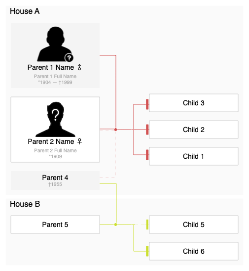
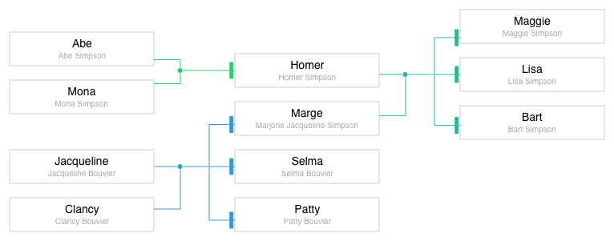
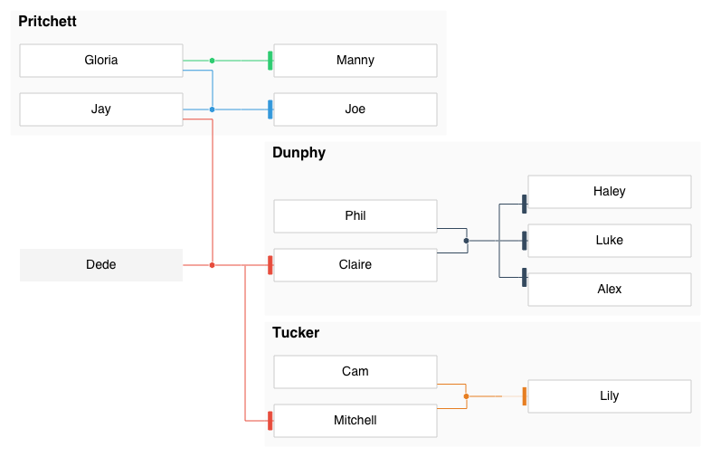
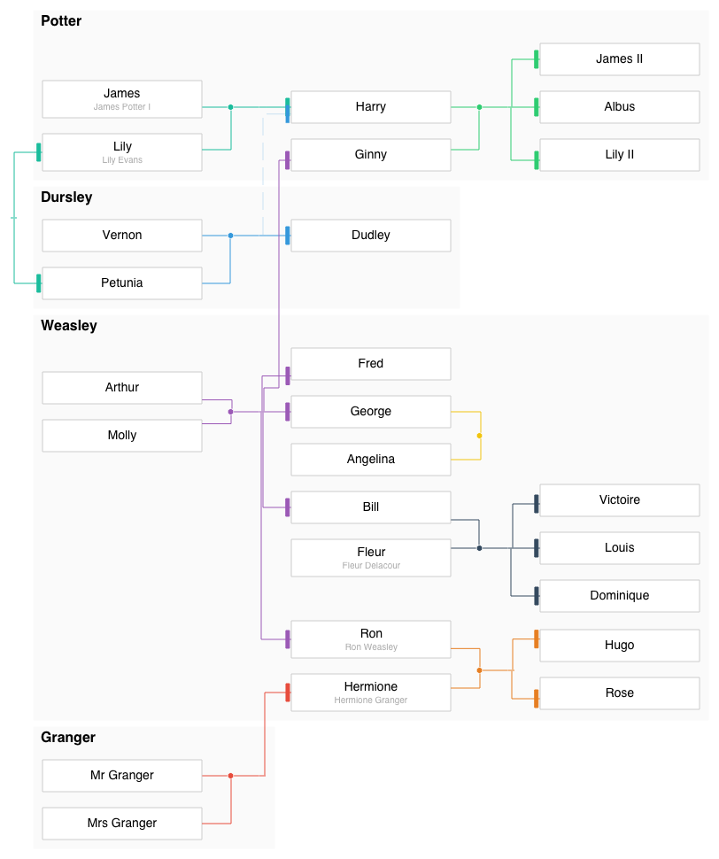
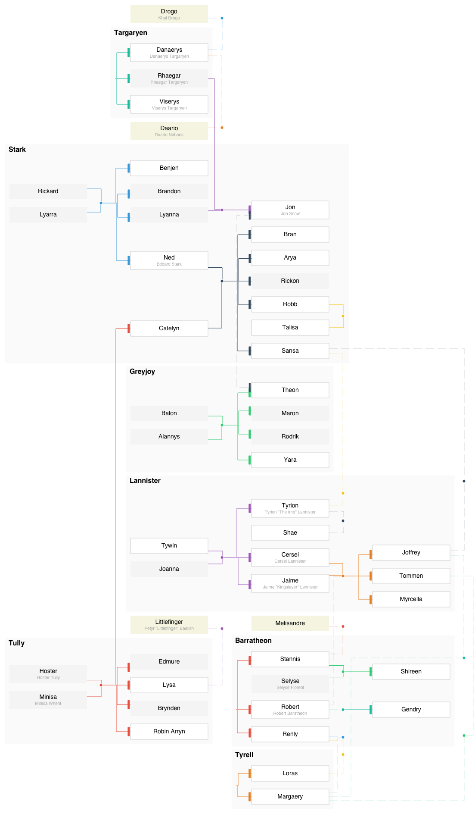

# kingraph

[](https://opensource.org/licenses/MIT)
[](https://travis-ci.org/AlexanderWillner/kingraph?branch=master)
[](http://codecov.io/github/AlexanderWillner/kingraph?branch=master)
[](https://codeclimate.com/github/AlexanderWillner/kingraph)
[](https://david-dm.org/AlexanderWillner/kingraph)
[](https://github.com/AlexanderWillner/kingraph/issues)

> 👪 Plots family trees using JavaScript and Graphviz

A family tree plotter with a very simple syntax. It probably doesn't cover everything [bigger tools](https://gramps-project.org/) do, but covers 90% of it for the sake of simplicity.



## Installation

```sh
npm install -g alexanderwillner/kingraph
```

This adds the `kingraph` command to your shell. With `kingraph --help` you can get basic information on how to execute the tool.

## Getting started

A family tree is a [YAML](http://yaml.org/) file. To get started, store the following text in a file called `family.yaml`:

```yaml
families:
  - parents: [Marge, Homer]
    children: [Bart, Lisa, Maggie]
  - parents: [Lisa, Milhouse]
    children: [Zia]

people:
  Marge:
    fullname: Marjorie Bouvier Simpson
```

```sh
kingraph family.yaml -F dot | dot -Tpdf -o family.pdf
open family.pdf
```

## Further Examples

Spoiler alerts, view at your own risk :)

<details>
<summary><b>Simpsons</b> (simple)</summary>

Source: *[simpsons.yaml](examples/simpsons.yaml)*

> 
</details>

<details>
<summary><b>Modern Family</b> (simple with houses)</summary>

Source: *[modernfamily.yaml](examples/modernfamily.yaml)*

> 
</details>

<details>
<summary><b>Harry Potter</b> (larger tree)</summary>

Source: *[potter.yaml](examples/potter.yaml)*

> 
</details>

<details>
<summary><b>Game of Thrones</b> (overly complicated)</summary>

Source: *[got.yaml](examples/got.yaml)*

> 
</details>

## Documentation

For further reading:

- [Getting started](docs/getting_started.md)
- [Advanced usage](docs/advanced.md)
- [Schema](docs/schema.md)

## Thanks

Authored and initially maintained by Rico Sta. Cruz with help from contributors ([list][contributors]).

> [ricostacruz.com](http://ricostacruz.com) &nbsp;&middot;&nbsp;
> GitHub [@rstacruz](https://github.com/rstacruz) &nbsp;&middot;&nbsp;
> Twitter [@rstacruz](https://twitter.com/rstacruz)

[contributors]: http://github.com/rstacruz/kingraph/contributors
